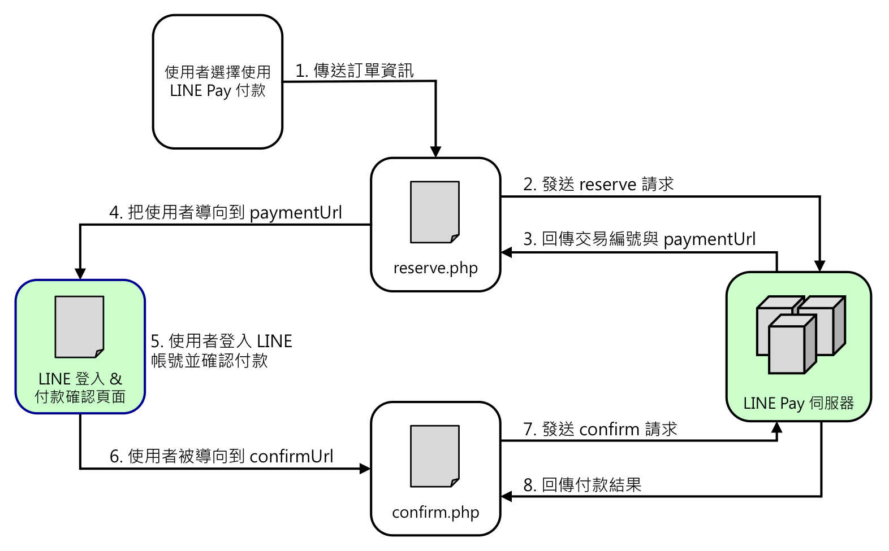

# LINE Pay 一般付款的教學與範例
此教學以在 Sandbox 環境進行一般付款（付款授權與請款同時進行）為範例 <br>
（正式環境僅需更改呼叫的 API 位址即可）

## 目錄
* [LINE Pay 付款流程說明](#line-pay-付款流程說明)
  * [角色](#角色)
  * [流程](#流程)
* [付款功能開發範例](#付款功能開發範例)
  * [購物網站的付款流程與頁面](#購物網站的付款流程與頁面)
  * [步驟](#步驟)

## LINE Pay 付款流程說明：
以下流程是以**電腦版網頁介面**來進行**付款授權與請款同時進行**的一般付款為例：
> LINE Pay 的一般付款包含兩種：「同時進行」付款授權與請款，或「分開進行」

#### 角色
在一次的付款的流程中，可以想像有三種角色參與其中：
* 商家的購物網站（包含前端頁面與後端伺服器）
* 網站使用者（買家）
* LINE Pay 伺服器  

#### 流程
1. 使用者在購物網站上選擇使用 LINE Pay 付款
2. 購物網站發送 Reserve 請求給 LINE Pay 伺服器，參數包含訂單的名稱、金額、確認付款頁面的位置(`confirmUrl`)等
3. LINE Pay 伺服器成功收到 Reserve 請求後，會回傳交易編號與付款頁面的位址(`paymentUrl`)給購物網站
4. 購物網站把使用者導向到`paymentUrl`
5. 使用者登入 LINE 帳號進行付款
6. 付款完成後，LINE 會把使用者導回至購物網站的確認付款頁面（即第 2 步驟內的`confirmUrl`）  
7. 購物網站發送 Confirm 請求給 LINE Pay 伺服器，向 LINE Pay 確認使用者是否已經進行付款  
8. LINE Pay 伺服器回傳付款結果
  
## 付款功能開發範例
* PHP 版本: v5.4以上
* LINE Pay API 版本: v2
* 使用 LINE Pay API 的[事前準備](/README.md)
* [測試工具原始碼（PHP、HTML 網頁介面）] (/sample)
* [PHP Library for LINE Pay API] (/sample/LINEPay.php)

#### 購物網站的付款流程與頁面
依照上面的 LINE Pay 付款流程，我們可以把購物網站的 LINE Pay 付款功能流程設計為：  


此流程中包含兩個 PHP 頁面：  
`Reserve.php`: 把訂單資訊發送給 LINE Pay 伺服器的頁面  
`Confirm.php`: 使用者在 LINE Pay 付款完成後，被重新導向至購物網站的頁面，同時也會向 LINE Pay 伺服器確認付款結果


#### 步驟
1. 在購物網站的付款頁面放上「使用 LINE Pay 付款」的按鈕，買家點擊此按鈕後，購物網站會透過 `Reserve.php` 發送訂單資訊給 LINE Pay 伺服器。

  > *按鈕樣式可參考官方[LOGO 使用指南](https://pay.line.me/tw/intro/logoUsageGuide)  
  > *`Reserve.php` 的功能其實只是要發送請求，可以不用 UI 畫面。

2. 在 `Reserve.php` 使用 LINE Pay Reserve API，將訂單的資訊作為參數發送 POST 請求給 LINE Pay 伺服器，Reserve API 的參數須包含訂單的名稱、金額、確認付款頁面的位置(`confirmUrl`)等。Reserve API 的規格與必要參數如下：

  #### Reserve API 規格  

  項目 | 說明
  ---- | --- 
  Method | POST
  Required Request Header | `Content-Type:application/json; charset=UTF-8`<br>`X-LINE-ChannelId:{{channelId}}`<br>`X-LINE-ChannelSecret:{{channelSecretKey}}`
  Sandbox 環境 API 地址 | https://sandbox-api-pay.line.me/v2/payments/request
  Real 環境 API 地址 | https://api-pay.line.me/v2/payments/request

    
  #### Reserve API 請求的必要參數  

  名稱 | 資料型別 | 說明
  ---- | ------- | ---
  productName | String | 訂單名稱，例如：`商品XXX..等oo項`（單一商品則顯示單項名稱即可）
  productImageUrl | String | 商品圖片 URL，顯示於付款畫面上的影像（若無商品圖請使用企業圖示）
  amount | Number | 付款金額
  currency | String | 付款貨幣 (ISO 4217)，例如 `TWD`、`JPY`、`USD`、`THB`
  confirmUrl | String | 買家在 LINE Pay 選擇付款方式並輸入密碼後，被重新導向到商家的 URL
  orderId | String | 商家與該筆付款請求對應的訂單編號（這是商家自行管理的唯一編號）

  > 還有其他的非必要參數請參考官方[LINE Pay 技術連動指南](https://pay.line.me/tw/intro/techSupport) <br>
  > [註]：一般付款情況下，請勿自行設置 mid 參數 <br>（此參數為提供 LINE Pay 伺服器辨識 LINE 用戶帳號登入的唯一編號，一般情況下用戶完成登入動作後便會自動提供給伺服器辨識；自行設置錯誤的ID會導致伺服器辨識失敗）

  #### Reserve.php 程式碼範例  

  ``` php
  <?php 

  include "LINEPay.php"; // 引用LinePay PHP Library

  $channelId     = "...";  // 通路ID
  $channelSecret = "...";  // 通路密鑰
  $environ       = "...";  // 呼叫環境

  $LINEPay = new LINEPay($environ, $channelId, $channelSecret); // 建立 LINEPay 物件

//// Call Reserve API

  // 建立訂單資訊作為 POST 的參數
  $rArray = array(
      "productName"     => "...",
      "productImageUrl" => "...",
      "amount"          => "...",
      "currency"        => "...",
      "confirmUrl"      => "...",
      "orderId"         => "...",
      "confirmUrlType"  => "...",
  );

  // 透過建立的 LINEPay 物件，以Reserve API 要求的各項參數呼叫同名函式
$response = $LINEPay->reserve($rArray);

  // 如果請求成功，將使用者導向 paymentUrl 的頁面
$ack = json_decode($response);
if ($ack->returnCode == "0000") {
	$paymentURL = $ack->info->paymentUrl->web; 
	echo "<a href=$paymentURL>Click to next step</a>"; // 顯示可以點選的"下一步"連結
} 
  ```
3. 若請求成功，LINE Pay 伺服器會回傳：

  #### Reserve API 回應 (JSON 格式)

  ```
  {
    "returnCode": "0000",          // 結果代碼，例如 `0000` 表示成功
    "returnMessage": "success",    // 結果訊息或失敗理由，例如 `商家驗證資訊錯誤`
    "info": {
      "paymentUrl": {             
        "web": "...",              // 付款請求後所前往的網頁 URL (LINE Pay 等待付款畫面的 URL)
        "app": "..."               // 前往付款畫面的應用程式 URL
      },
      "transactionId": ...,        // 交易編號 (19 位數)
      "paymentAccessToken": "..."  // 在 LINE Pay app 輸入的代碼（在本範例未使用到）
    }
  }
  ```

4. 在 `Reserve.php` 收到請求成功的回應後，就可以把使用者導向到 `paymentUrl` 的頁面（電腦版請使用 `info.paymentUrl.web` 的 URL），此頁面為 LINE 提供的登入與付款頁面，如圖：
  

5. 使用者在此頁面登入 LINE 帳號後，會出現 LINE Pay 的彈出視窗（如下圖），確認商品名稱與金額無誤後，點擊 PAY NOW 即可進行付款。
  > 如果瀏覽器有封鎖此頁面的彈出視窗，可先解除對此 LINE Pay 網域的封鎖  

  

6. 付款完成後，剛剛開啟 `paymentUrl` 的頁面會被導向至 `confirmUrl`，`confirmUrl` 就是在第 2 步發出 Reserve 請求時所傳遞給 LINE Pay 伺服器的參數之一。在本範例中，也就是把使用者導回至購物網站的 `Confirm.php` 頁面。

7. 在 `Confirm.php` 使用 LINE Pay Confirm API，發送 POST 請求給 LINE Pay 伺服器，向 LINE Pay 確認使用者是否已經完成付款。Confirm API 的規格與必要參數如下：
  
  #### Confirm API 規格  

  項目 | 說明
  ---- | --- 
  Method | POST
  Required Request Header | `Content-Type:application/json; charset=UTF-8`<br>`X-LINE-ChannelId:{{channelId}}`<br>`X-LINE-ChannelSecret:{{channelSecretKey}}`
  Sandbox 環境 API 地址 | https://sandbox-api-pay.line.me/v2/payments/{{transactionId}}/confirm
  Real 環境 API 地址 | https://api-pay.line.me/v2/payments/{{transactionId}}/confirm

  #### Confirm API 請求的必要參數  

  名稱 | 資料型別 | 說明
  ---- | ------- | ---
  amount | Number | 付款金額
  currency | String | 付款貨幣 (ISO 4217)，例如 `TWD`、`JPY`、`USD`、`THB`

  #### Confirm.php 程式碼範例  

  ``` php
  <?php 

  include "LINEPay.php"; // 引用LinePay PHP Library

  $channelId     = "...";  // 通路ID
  $channelSecret = "...";  // 通路密鑰
  $environ       = "...";  // 呼叫環境

  $LINEPay = new LINEPay($environ, $channelId, $channelSecret); // 建立 LINEPay 物件

//// Call Confirm API
  // 建立 Confirm API 所需要的參數
  $cArray = array(
      "amount"   => "...",
      "currency" => "...",
  );

  // transactionId 來自之前 Reserve API 請求的回應
  $transactionId = "...";

  // 透過建立的 LINEPay 物件，以 Confirm API 要求的交易編碼及參數呼叫同名函式
  $result = $LinePay->confirm($transactionId, $cArray);

  $ack = json_decode($response);
if ($ack->returnCode == "0000") {
    // Confirm 請求成功!
  }
else {
 // Confirm 請求失敗
 // 透過呼叫付款紀錄查詢 API 檢視此交易是否已經進行過（註）
}
  ```
  
8. 若請求成功，表示使用者確實已經透過 LINE Pay 進行付款，LINE Pay 伺服器會回傳：

  #### Confirm API 回應 (JSON 格式)

  ```
  {
    "returnCode": "0000",        // 結果代碼，例如 `0000` 表示成功
    "returnMessage": "success",  // 結果訊息或失敗理由，例如 `商家驗證資訊錯誤`
    "info": {
      "transactionId": ...,      // 付款 reserve 後,做為結果所收到的交易編號
      "orderId": "...",          // 商家在付款reserve 時傳送的訂單編號
      "payInfo": [
        {
          "method": "...",       // 使用的付款方式 (信用卡: CREDIT_CARD、餘額: BALANCE,折扣: DISCOUNT)
          "amount": "...",       // 付款金額
          ...
        }
      ]
    }
  }
  ```

> [註]：有時買家在頁面重新導向的過程中因為讀取速度較慢，可能會按重新整理導致重送請求。此時由於 LINE Pay 伺服器已經在第一次送出時便判定交易成功，之後收到的請求則因為同樣的交易編號已經存在而回報錯誤。此情形將導致商家端與 LINE Pay 商家後台的紀錄不符，因此建議在呼叫 Confirm API 之後透過呼叫取得付款紀錄 API（get payment detail）確認該交易是否曾判定為交易成功，再來對商家端的系統進行處理。

## 若是付款授權與請款「分開」進行
如果商家有提供給買家鑑賞期的需求，希望將付款授權與請款兩者分別處理的話，只須在購物網站發送 Reserve 請求時，將參數 `capture` 設定為 `false`(表示不要立即請款)，原本的 Confirm 請求就會變成是「付款授權」而已，而實際付款必須再由購物網站發送額外的 Capture 請求才會完成。

#### Capture API 規格  

項目 | 說明
---- | --- 
Method | POST
Required Request Header | `Content-Type:application/json; charset=UTF-8`<br>`X-LINE-ChannelId:{{channelId}}`<br>`X-LINE-ChannelSecret:{{channelSecretKey}}`
Sandbox 環境 API 地址 | https://sandbox-api-pay.line.me/v2/payments/authorizations/{{transactionId}}/capture
Real 環境 API 地址 | https://api-pay.line.me/v2/payments/authorizations/{{transactionId}}/capture

#### Capture API 請求的必要參數  

名稱 | 資料型別 | 說明
---- | ------- | ---
amount | Number | 付款金額
currency | String | 付款貨幣 (ISO 4217)，例如 `TWD`、`JPY`、`USD`、`THB`

換句話說，若分開付款授權與請款，原本購物網站發送 Confirm 請求時並不會完成訂單的付款，而是將該訂單記錄為「已授權」而已。  

<!-- 故在鑑賞其內可再使用「授權作廢 」請求來取消該筆交易，不必讓使用者先付款再進行退款。 -->
